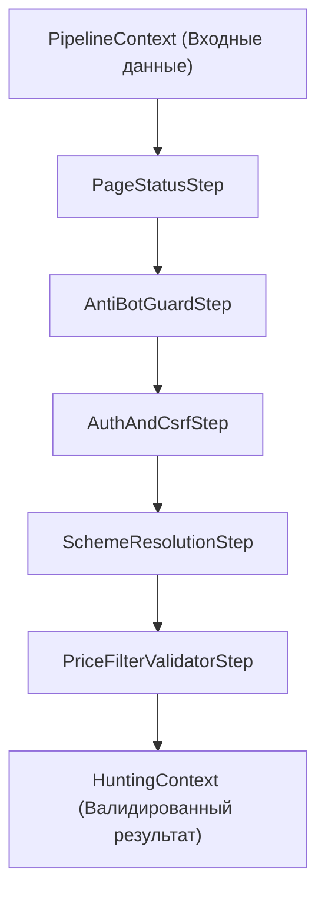
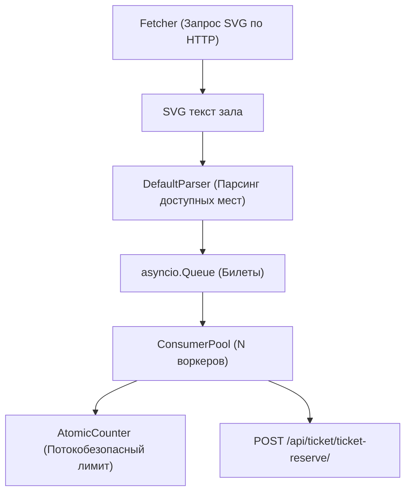

# Архитектура и структура ядра (Core)

---

## 1. Слой предстартовой подготовки (`core/pipeline/`)

Подсистема реализует паттерн *Chain of Responsibility* для поэтапной валидации и обогащения контекста перед запуском сессии охоты.



### 1.1. Контексты данных (`core/pipeline/context.py`)

- **`PipelineContext` (Dataclass)**
  - *Назначение:* Изменяемый объект состояния, передаваемый через цепочку шагов пайплайна.
  - *Поля:*
    - `event_id: str` — идентификатор мероприятия.
    - `event_name: str` — наименование мероприятия.
    - `target_tickets: int = 1` — целевое количество билетов для бронирования.
    - `num_consumers: int = 5` — количество параллельных воркеров бронирования.
    - `poll_interval: float = 1.0` — частота опроса схемы зала (в секундах).
    - `raw_cookies: dict[str, str]` — сессионные куки.
    - `csrf_token: str | None` — CSRF-токен сессии.
    - `page_status: int = 200` — HTTP-код ответа страницы мероприятия.
    - `allowed_price_ids: list[str] | None` — явно выбранные ID категорий цен.
    - `min_price / max_price: float | None` — числовой диапазон цен.
    - `allowed_sectors: list[str] | None` — фильтр по секторам зала.
    - `all_event_prices: list[dict]` — полный каталог доступных цен мероприятия.
    - `svg_url: str | None` — прямой URL к SVG-файлу схемы зала.
    - `resolved_price_ids: set[str]` — результирующий набор валидированных ID цен.
    - `client: httpx.AsyncClient | None` — опциональный переиспользуемый HTTP-клиент.

- **`HuntingContext` (Dataclass)**
  - *Назначение:* Неизменяемый, полностью валидированный снимок параметров, передаваемый в `BotSession` для непосредственного старта охоты.
  - *Поля:* `event_id`, `event_name`, `svg_url`, `valid_price_ids`, `allowed_sectors`, `target_tickets`, `num_consumers`, `poll_interval`, `cookies`, `csrf_token`, `all_event_prices`.

### 1.2. Исключения (`core/pipeline/exceptions.py`)

- **`PreflightError(Exception)`**
  - *Назначение:* Типизированное исключение предстартовой проверки.
  - *Поля:* `code: str` (машиночитаемый код), `message: str` (описание), `hint: str` (инструкция по устранению), `step_name: str` (имя упавшего шага).
  - *Методы:* `to_dict() -> dict` — сериализация ошибки для API.

### 1.3. Базовый конвейер (`core/pipeline/base.py`)

- **`PipelineStep` (ABC)**
  - *Назначение:* Абстрактный контракт шага валидации.
  - *Методы:* `async execute(ctx: PipelineContext) -> None` — выполняет проверку или обогащает контекст. При ошибке выбрасывает `PreflightError`.

- **`PreflightPipeline`**
  - *Назначение:* Исполнитель цепочки шагов.
  - *Методы:*
    - `add_step(step: PipelineStep) -> Self` — добавление шага в конец.
    - `insert_before(target_name: str, step: PipelineStep) -> Self` — вставка шага перед указанным.
    - `async run(ctx: PipelineContext) -> HuntingContext` — последовательное выполнение всех шагов и сборка итогового `HuntingContext`.

### 1.4. Изолированные шаги (`core/pipeline/steps/`)

- **`PageStatusStep`**: Проверяет `ctx.page_status`. Выбрасывает `EVENT_NOT_FOUND` (404), `ACCESS_RESTRICTED` (403/429), `UPSTREAM_SERVER_ERROR` (500+) или `INVALID_PAGE_STATUS`.
- **`AntiBotGuardStep`**: Шаг-заглушка и точка расширения на случай внедрения анти-бот защиты (Cloudflare Turnstile / Captcha / DDoS-Guard). На данный момент выполняет базовую проверку валидности сессионного токена `cf_clearance` в `ctx.raw_cookies`.
- **`AuthAndCsrfStep`**: Проверяет наличие CSRF-токена в контексте. При его отсутствии выполняет фоновый запрос к странице мероприятия через `Fetcher` для извлечения токена и сессионных кук.
- **`SchemeResolutionStep`**: Запрашивает через `Fetcher.fetch_scheme_url()` прямую ссылку на SVG-схему зала. При отсутствии схемы выбрасывает `SCHEME_NOT_FOUND`.
- **`PriceFilterValidatorStep`**: Сопоставляет переданные `allowed_price_ids` или диапазон `[min_price, max_price]` с каталогом `all_event_prices`. Формирует итоговый `ctx.resolved_price_ids`. Если ни одна цена не подошла — выбрасывает `NO_MATCHING_PRICES`.

### 1.5. Фабрики конвейеров (`core/pipeline/__init__.py`)

- **`build_presession_pipeline() -> PreflightPipeline`**
  - Состав: `[PageStatusStep, AntiBotGuardStep, AuthAndCsrfStep, SchemeResolutionStep]`.
  - Запускается пассивно при получении HTML страницы мероприятия.
- **`build_start_pipeline() -> PreflightPipeline`**
  - Состав: `[PageStatusStep, PriceFilterValidatorStep]`.
  - Запускается мгновенно при нажатии старта (0 мс сетевой задержки за схемой).
- **`build_default_preflight_pipeline() -> PreflightPipeline`**
  - Состав: Полный набор из всех 5 шагов для скриптового режима.

---

## 2. Слой скоростных задач (`core/tasks/`)

Модули, инкапсулирующие сетевые запросы, парсинг SVG и параллельное бронирование.



### 2.1. Сетевой загрузчик (`core/tasks/fetcher.py`)

- **`Fetcher`**
  - *Назначение:* Инкапсуляция HTTP-взаимодействия с внешними эндпоинтами Ticketpro.
  - *Поля:* `event_id`, `event_url`, `headers_template`.
  - *Методы:*
    - `async fetch_page(event_id, client) -> tuple[str, dict, str | None] | None` — загрузка HTML страницы, кук и CSRF-токена.
    - `async fetch_scheme_url(event_id, client) -> str | None` — запрос к `get-scheme-prices-grouped/{event_id}` и извлечение SVG URL.
    - `async fetch_svg(svg_url, client) -> str | None` — скоростная загрузка сырого SVG-файла схемы зала.

### 2.2. Парсер схемы зала (`core/tasks/parser.py`)

- **`Ticket` (Dataclass)**
  - *Поля:* `ticket_id: str`, `price_id: str`, `name: str`
  - *Методы:*
    - `[property] sector: str`. 
    - `[property] row: str`.
    - `[property] seat: str`.
    - `__iter__` - позволяет пройтись по первым двум полям класса

- **`BaseParser` (ABC)**
  - *Контракт:* `parse(svg_content: str) -> list[Ticket]`, `extract_event_prices(html_content: str) -> dict[str, dict]`.

- **`DefaultParser(BaseParser)`**
  - *Назначение:* Высокоскоростной разбор SVG-схемы зала через регулярные выражения (`re.finditer`).
  - *Инкапсулированная фильтрация:*
    - Игнорирует серые (занятые) места: `fill="#999999"`, `fill="#c0c0c0"`.
    - Фильтрует группы цен по `valid_price_ids` и `allowed_price_ids`.
    - Фильтрует сектора зала по `allowed_sectors`.
    - Поддерживает кастомную функцию `filter_fn`.
  - *Методы:*
    - `parse(svg_text, queue=None) -> list[Ticket]` — парсит доступные места из SVG (опционально стримит в очередь).
    - `extract_event_prices(html_text) -> dict[str, dict]` — извлекает словарь цен `window.prices_of_event` или из HTML-тегов страницы.

### 2.3. Пул параллельных бронировщиков (`core/tasks/consumer.py`)

- **`AtomicCounter`**
  - *Назначение:* Потокобезопасный (в рамках Event Loop) счетчик успешных бронирований.
  - *Методы:*
    - `async try_acquire_slot() -> bool` — атомарно резервирует слот бронирования, если счетчик `< target`.
    - `async release_slot() -> None` — возвращает слот при ошибке запроса бронирования.
    - `async is_completed() -> bool` — проверяет, достигнут ли целевой лимит.

- **`Consumer`**
  - *Назначение:* Низкоуровневый HTTP-клиент резервации конкретного билета.
  - *Поля:* `cookies`, `headers`, `post_url`, `params_template`.
  - *Методы:*
    - `async book(params, client=None) -> dict` — отправка `POST /api/ticket/ticket-reserve/?ticket_id={id}&price_id={price}&count=1`.
    - `async consume(counter, queue, client=None, on_book_callback=None) -> None` — цикл единичного воркера (для обратной совместимости).

- **`ConsumerPool`**
  - *Назначение:* Оркестратор пула параллельных воркеров бронирования.
  - *Поля:* `num_consumers`, `queue`, `counter`, `consumer: Consumer`, `is_running: bool`, `stop_event: asyncio.Event`, `_tasks: list[asyncio.Task]`.
  - *Методы:*
    - `start(client: httpx.AsyncClient) -> None` — запускает `N` параллельных корутин `_worker(client, worker_id)`.
    - `async _worker(client, worker_id) -> None` — рабочий цикл воркера: реактивное чтение очереди через `asyncio.wait([queue.get(), stop_event.wait()])`, резервация слота в `AtomicCounter`, отправка `Consumer.book()` и вызов `on_book_callback`.
    - `async shutdown() -> None` — детерминированная остановка воркеров: взводит `stop_event`, отменяет активные корутины и ожидает завершения через `asyncio.gather`.

---

## 3. Слой DTO схем (`core/schemas.py`)

Слой Pydantic-моделей, изолирующий ядро от структур внешних веб-запросов и ответов.

- **`StartBotRequest(BaseModel)`**: DTO входящего запроса на запуск бота (`event_id`, `target_tickets`, `allowed_price_ids`, `min_price`, `max_price`, `csrf_token`, `page_status`).
  - *Метод:* `to_pipeline_context(cookies, all_event_prices, svg_url) -> PipelineContext` — чистая конвертация DTO в структуру ядра.
- **`StopBotRequest(BaseModel)`**: DTO запроса на остановку (`event_id`).
- **`ActivateSessionRequest(BaseModel)`**: DTO активации сессии мероприятия (`event_id`).
- **`PresessionResponse(BaseModel)`**: DTO ответа предсессии (`event_id`, `event_name`, `prices`, `valid_price_ids`, `has_csrf`, `page_status`, `has_scheme`, `svg_url`, `error`).
- **`BotStatusResponse(BaseModel)`**: DTO текущего статуса бота (`status`, `target`, `booked`, `is_running`, `valid_prices`).
- **`PreflightErrorResponse(BaseModel)`**: DTO ошибки предстартовой проверки (`status="error"`, `error: PreflightErrorDetail`).

---

## 4. Оркестратор и жизненный цикл сессий (`core/bot.py`)

Центральный управляющий модуль ядра.

```mermaid
graph TD
    BotManager["BotManager (Синглтон)"] -->|prepare_presession()| PresessionData["PresessionData (Кэш цен и SVG)"]
    BotManager -->|start_session() под Lock| BotSession["BotSession (Снайпер события)"]
    BotSession --> ProducerLoop["_run_producer_loop()"]
    BotSession --> ConsumerPool["ConsumerPool (Воркеры брони)"]
    BotSession --> BroadcastQueue["subscribers: Queue (SSE события)"]
```

### 4.1. Статусы и предсессия

- **`BotStatus(str, Enum)`**: `IDLE`, `RUNNING`, `FINISHED`, `STOPPED`, `ERROR`.
- **`PresessionData` (Dataclass)**:
  - *Назначение:* Легковесный объект предсессии, сохраняемый при открытии страницы мероприятия.
  - *Поля:* `event_id`, `event_name`, `prices`, `valid_price_ids`, `cookies`, `csrf_token`, `svg_url`, `page_status`, `error`, `updated_at`.
  - *Метод:* `to_dict() -> dict` — сериализация для API.

### 4.2. Сессия охоты (`BotSession`)

- **`BotSession`**
  - *Назначение:* Автономный движок охоты за билетами для конкретного мероприятия. Инкапсулирует парсер, пул консьюмеров, фетчер - вызов этих классов вне BotSession не рекомендован.
  - *Входные данные:* Принимает готовый `HuntingContext` (не содержит логики валидации или поиска схемы).
  - *Поля:* `ctx: HuntingContext`, `status: BotStatus`, `booked: int`, `task: asyncio.Task`, `subscribers: set[asyncio.Queue]`, `consumer_pool: ConsumerPool`.
  - *Методы управления:*
    - `async start() -> None` — порождает фоновую задачу `_hunt()`.
    - `stop() -> None` — отменяет таску, останавливает `ConsumerPool`, переводит статус в `STOPPED`, оповещает подписчиков.
    - `subscribe() -> asyncio.Queue` / `unsubscribe(q)` — регистрация очередей для live-вещания событий.
    - `broadcast(event_data: dict) -> None` — рассылка JSON-событий всем подписчикам.
  - *Методы охоты:*
    - `async _hunt(get_client, post_client) -> int` — инициализирует очередь билетов, запускает `ConsumerPool`, стартует `_run_producer_loop` и обрабатывает результаты.
    - `async _run_producer_loop(svg_url, queue, counter, client) -> None` — цикл опроса SVG с интервалом `poll_interval`. При обнаружении новых билетов кладёт их в очередь и эмитит события `tickets_streamed`.

### 4.3. Фасад управления (`BotManager`)

- **`BotManager`**
  - *Назначение:* Реестр и фасад управления сессиями и предсессиями.
  - *Поля:*
    - `presessions: dict[str, PresessionData]` — хранилище предсессий по `event_id`.
    - `sessions: dict[str, BotSession]` — хранилище активных сессий по `event_id`.
    - `_locks: dict[str, asyncio.Lock]` — словарь асинхронных мьютексов по `event_id` для защиты от race condition.
    - `presession_pipeline`, `start_pipeline`, `default_pipeline` — предсобранные конвейеры.
  - *Методы:*
    - `async prepare_presession(event_id, html_text, cookies, event_name, page_status) -> PresessionData`:
      Запускает `PresessionPipeline`. Если статус `200` — парсит цены, токен и резолвит `svg_url`. При не-200 статусе сбрасывает кэш цен. Сохраняет и возвращает `PresessionData`.
    - `async start_session(req, cookies, pipeline) -> BotSession`:
      Выполняется под `async with self._get_lock(eid):`. Останавливает предыдущую сессию события (если была). Берёт `svg_url` из предсессии. Прогоняет `StartPipeline` (быстрый старт за 0 мс). Создаёт `BotSession` и вызывает `session.start()`.
    - `get(event_id) -> BotSession | None` — получение сессии.
    - `get_presession(event_id) -> PresessionData | None` — получение предсессии.
    - `stop(event_id) -> bool` — остановка сессии по ID события.
    - `async stop_all() -> int` — параллельная остановка всех активных сессий при выключении сервера.
    - `list_all() -> dict` — сводная статистика по всем задачам и забронированным билетам.

- **`bot_manager`**: Глобальный синглтон-экземпляр `BotManager`.

---

## 5. Скриптовый запуск (`core/runner.py`)

- **`Core`**
  - *Назначение:* Автономная обертка для запуска снайпера в консольном/скриптовом режиме без веб-сервера.
  - *Параметры `__init__`:* `event_id`, `target_tickets=1`, `num_consumers=5`, `svg_url`, `parser=None`, `event_callback=None`.
  - *Поля:* `ctx: HuntingContext`, `session: BotSession`, `event_callback`, `event_id`, `target_tickets`, `num_consumers`, `parser`.
  - *Метод:* `async run(get_client=None, post_client=None, initial_cookies=None, initial_headers=None) -> int` — инициализирует куки, настраивает пересылку событий в `event_callback` (при наличии) и напрямую запускает `BotSession._hunt()`.
