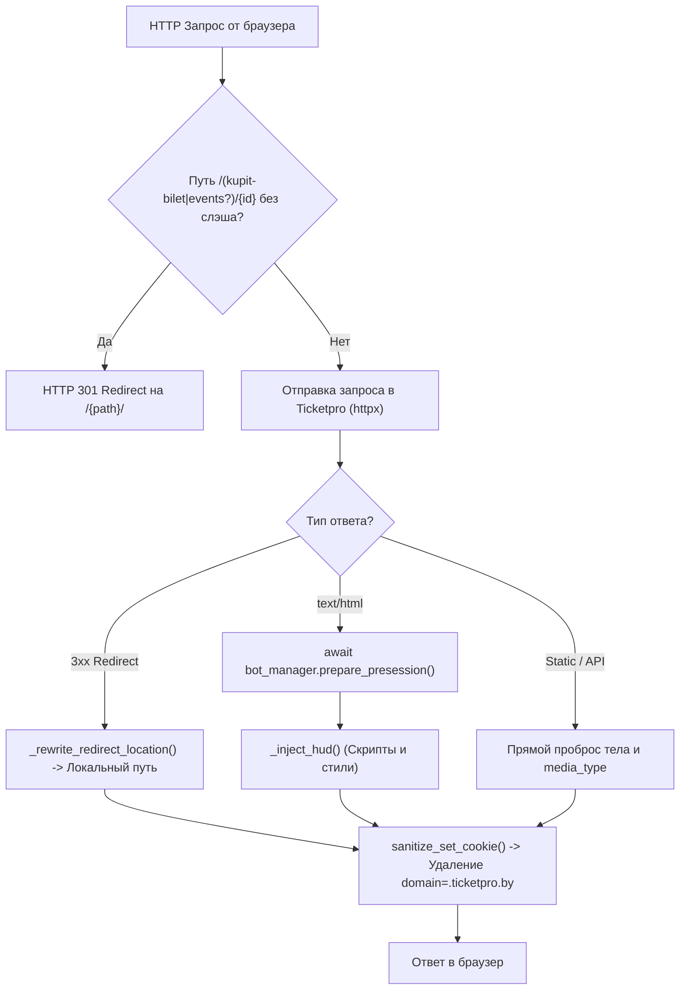
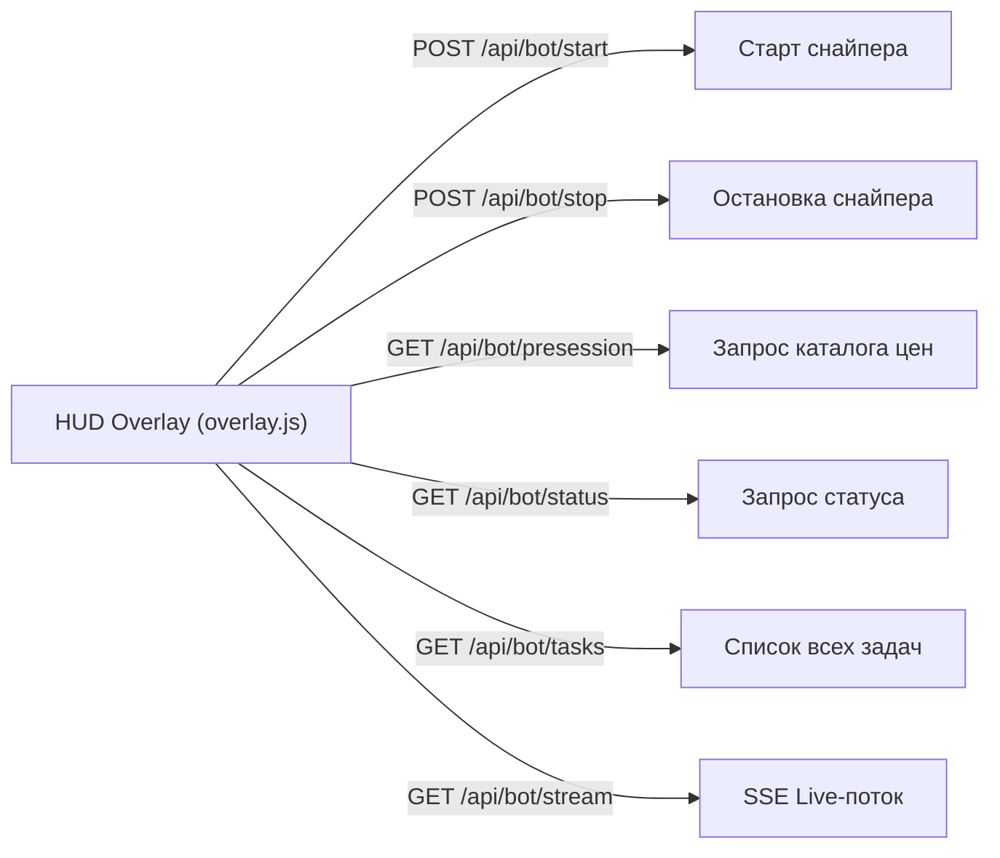

# Архитектура и структура веб-слоя (Web)

---

## 1. Общая структура веб-слоя

Веб-слой отвечает за реверс-проксирование оригинального сайта `ticketpro.by`, внедрение интерфейса управления (HUD) в DOM страниц, REST API и Server-Sent Events (SSE) для взаимодействия с ядром бота.

```mermaid
graph TD
    ClientBrowser["🌐 Браузер пользователя"] <--> Proxy["web/proxy.py (Reverse Proxy & Injector)"]
    ClientBrowser <--> API["web/api.py (REST & SSE API)"]
    
    Proxy <--> Ticketpro["🏢 Ticketpro.by (Целевой сервер)"]
    Proxy -->|prepare_presession()| BotManager["core/bot.py (BotManager)"]
    API <-->|start / stop / stream / tasks| BotManager
    
    Proxy -.->|Инъекция в HTML| Static["web/static/ (overlay.js + overlay.css)"]
```

---

## 2. Модуль сервера (`web/server.py`)

- **`lifespan(app: FastAPI)` (Async Context Manager)**
  - *Назначение:* Управление жизненным циклом веб-сервера.
  - *Логика:*
    - При старте: логирует запуск сервиса.
    - При завершении (`shutdown`): вызывает `await bot_manager.stop_all()` для гарантированной остановки всех активных сессий без дедлоков.
- **`app: FastAPI`**
  - Экземпляр приложения FastAPI с зарегистрированным `lifespan`.
  - Монтирует статические файлы оверлея: `app.mount("/proxy-static", StaticFiles(directory=STATIC_DIR), name="proxy-static")`.
  - Регистрирует маршрутизаторы: `app.include_router(bot_router)` и `app.include_router(proxy_router)`.
- **`main()`**
  - Запускает Uvicorn-сервер: `uvicorn.run("web.server:app", host="0.0.0.0", port=8000, reload=False, timeout_graceful_shutdown=1)`.

---

## 3. Модуль реверс-прокси (`web/proxy.py`)

Модуль прозрачного проксирования HTTP-трафика между браузером и Ticketpro с инъекцией HUD и нормализацией URL.



### 3.1. Вспомогательные функции

- **`extract_event_id(path: str, referer: str = "") -> str | None`**
  - Извлекает числовой ID мероприятия из URL пути (`/(?:kupit-bilet|events?)/{id}/`) или заголовка `Referer`.
- **`_rewrite_redirect_location(location: str) -> str`**
  - Переписывает абсолютные редиректы Ticketpro (например, `https://www.ticketpro.by/order/auth/` $\to$ `/order/auth/`), удерживая пользователя внутри локального прокси.
- **`sanitize_set_cookie(cookie_header: str, is_secure: bool = False) -> str`**
  - Очищает заголовок `Set-Cookie` от `domain=.ticketpro.by` и нормализует флаги `SameSite`/`Secure`, чтобы куки сохранялись на `localhost`.
- **`_inject_hud(html_text: str, status_code: int = 200) -> str`**
  - Вставляет перед закрывающим тегом `</body>` (или в конец текста):
    - Стили оверлея: `<link rel="stylesheet" href="/proxy-static/overlay.css?v=...">`.
    - Глобальный статус страницы: `<script>window.__TP_PAGE_STATUS__ = {status_code};</script>`.
    - Скрипт логики: `<script src="/proxy-static/overlay.js?v=..."></script>`.

### 3.2. Роуты прокси и шорткаты

- **Прямые алиасы корзины (`/korzina`, `/basket`, `/cart` и их варианты со слэшем)**:
  - Отдают `302 Found` с редиректом на `/order/auth/` для быстрого перехода к чекауту.
- **`/{path:path}` (Все HTTP-методы: GET, POST, PUT, DELETE, OPTIONS, HEAD, PATCH)**:
  - *Нормализация:* Для путей `^(?:kupit-bilet|events?)/\d+$` отдаёт `301 Moved Permanently` с добавлением слэша на конце.
  - *Обогащение куками:* Подмешивает куки активной сессии (`session.ctx.cookies`) или предсессии (`presession.cookies`) для текущего `target_eid`.
  - *Обработка ответов:*
    - При `text/html`: асинхронно вызывает `await bot_manager.prepare_presession(target_eid, html_text, req_cookies, page_status=resp.status_code)` и инжектирует HUD.
    - При `3xx`: перезаписывает `Location`.
    - Для остальных типов данных: пробрасывает сырое тело с оригинальным `content-type`.
    - Санитизирует все заголовки `set-cookie`.

---

## 4. Модуль REST & SSE API (`web/api.py`)

Маршрутизатор `bot_router = APIRouter(prefix="/api/bot", tags=["Bot Management"])`.



### 4.1. Спецификация эндпоинтов

- **`POST /api/bot/start`**
  - *Тело запроса:* `StartBotRequest` (DTO: `event_id`, `target_tickets`, `allowed_price_ids`, `min_price`, `max_price`, `csrf_token`, `page_status`, `num_consumers`).
  - *Логика:* Извлекает куки запроса, вызывает `await bot_manager.start_session(req, cookies)`.
  - *Ответы:*
    - `200 OK`: `{"status": "ok", "message": "Sniper started...", "event_id": eid}`.
    - `400 Bad Request`: `PreflightErrorResponse` при ошибке валидации предстартового пайплайна (`code`, `message`, `hint`, `step`).
- **`POST /api/bot/stop`**
  - *Тело запроса:* `StopBotRequest` (`event_id`).
  - *Логика:* Вызывает `bot_manager.stop(req.event_id)`.
  - *Ответы:* `200 OK` (`status="ok"`) или `404 Not Found`.
- **`GET /api/bot/presession`**
  - *Query:* `event_id: str`.
  - *Логика:* Вызывает `bot_manager.get_presession(event_id)`.
  - *Ответы:* `200 OK` (`PresessionResponse`) или `404 Not Found`.
- **`GET /api/bot/event-prices`** (Обратная совместимость)
  - *Query:* `event_id: str`.
  - *Логика:* Вызывает `bot_manager.get_presession(event_id)` и возвращает структурированный словарь категорий цен `{"status": "ok", "event_id": eid, "prices": {...}, "valid_price_ids": [...]}`.
  - *Ответы:* `200 OK` или `404 Not Found`.
- **`GET /api/bot/status`**
  - *Query:* `event_id: str`.
  - *Логика:* Вызывает `bot_manager.get(event_id)`. Возвращает сериализованный статус сессии (`session.to_dict()`) или `{"status": "idle", ...}`.
- **`GET /api/bot/tasks`**
  - *Логика:* Вызывает `bot_manager.list_all()`.
  - *Ответ:* `{"total_booked": int, "active_count": int, "tasks": [...]}`.
- **`POST /api/bot/activate-session`**
  - *Тело запроса:* `ActivateSessionRequest` (`event_id`).
  - *Логика:* Извлекает куки сессии мероприятия и выставляет их в `Set-Cookie` ответа для переключения браузера на корзину выбранного события.
- **`GET /api/bot/stream` (SSE)**
  - *Query:* `event_id: str`.
  - *Логика:*
    - Проверяет наличие сессии. Если сессии нет — возвращает `404 Not Found`.
    - Подписывается на очередь событий: `q = session.subscribe()`.
    - Отправляет `data: {"type": "init", ...}` и затем в цикле транслирует поступающие из ядра события (`tickets_streamed`, `ticket_booked`, `finished`, `error`, `status`).
    - По завершении/отключении клиента в блоке `finally` вызывает `session.unsubscribe(q)`.

---

## 5. Фронтенд оверлея (`web/static/`)

Модуль пользовательского интерфейса, внедряемый в DOM страницы мероприятия.

### 5.1. Логика интерфейса (`web/static/overlay.js`)

- **Инициализация (`createWidget`)**:
  - Создаёт плавающий Glassmorphism-виджет в правом нижнем углу.
  - Вкладка 1 (`#tp-tab-pane-current`): управление текущим мероприятием (счетчик билетов, фильтры цен, кнопка запуска, Live Console).
  - Вкладка 2 (`#tp-tab-pane-all`): мониторинг всех запущенных фоновых задач.
  - Контейнер `#tp-error-container`: карточки ошибок с инструкциями.
  - Контейнер `#tp-controls-section`: нижняя часть панели с элементами управления.

- **Управление состоянием и кнопками**:
  - `loadPrices()`: Запрашивает `GET /api/bot/presession`. Отрисовывает интерактивные плашки категорий цен (Pills) с выбором. При ошибках/отсутствии схемы выводит предупреждение.
  - `showErrorBanner(title, message, instruction, onRetry, hideControls)`: Отрисовывает баннер с ошибкой и подсказкой. Если `hideControls=true`, скрывает `#tp-controls-section` (`display: none`).
  - `clearErrorBanner()`: Очищает баннер и восстанавливает видимость элементов управления (`display: block`).
  - `setRunningUI(target, booked)`: Мгновенно скрывает кнопку «Старт», показывает кнопку «Остановить» и пульсирующий индикатор охоты.
  - `resetUI()`: Закрывает SSE-соединение (`eventSource.close()`), возвращает кнопку «Старт» в активное состояние, скрывает кнопку «Остановить».

- **Обработка старта и предотвращение гонок**:
  - При клике на `tp-start-btn`:
    1. Кнопка немедленно блокируется (`disabled = true`).
    2. Вызывается `setRunningUI()` и `connectSSE()`.
    3. Отправляется `POST /api/bot/start`.
    4. При ошибке 400 вызывается `showErrorBanner()` и `resetUI()`.

- **SSE-клиент (`connectSSE`)**:
  - Слушает `/api/bot/stream?event_id=...`.
  - При событиях `ticket_booked` / `finished` вызывает `triggerBasketRefresh()` (авто-обновление корзины Ticketpro через `POST /api/ticket/get-basket/`).
  - При обрыве связи (`onerror`) сбрасывает интерфейс (`resetUI()`) и показывает уведомление об остановке сервера.

- **Фоновый мониторинг (`refreshTasksList`)**:
  - Каждые 3 секунды запрашивает `GET /api/bot/tasks` и обновляет карточки задач во второй вкладке.

### 5.2. Стили (`web/static/overlay.css`)

- Тёмная палитра (`#0f172a`, `#1e293b`).
- Glassmorphism эффекты (`backdrop-filter: blur(12px)`).
- Анимация пульсирующего индикатора (`.tp-status-dot` с keyframe `tp-pulse`).
- Адаптивные карточки задач и логов консоли.
